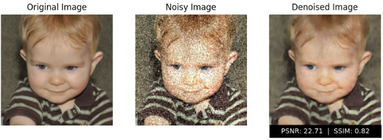

<object data="./Image%20Denoisor%20v1.2023.12.16.pdf" type="application/pdf" width="700px" height="700px">
    <embed src="./Image%20Denoisor%20v1.2023.12.16.pdf">
        <p>This browser does not support PDFs. Please download the PDF to view it: <a href="./Image%20Denoisor%20v1.2023.12.16.pdf">Download PDF</a>.</p>
    </embed>
</object>


# Enhanced RIDNet IMAGE DENOISOR



## FILEPATH

"""


Project Structure:
- main.py: The main entry point of the project.
- utils.py: Contains utility functions used in the project.
- datasets/: Directory containing the dataset for training and testing.
- models/: Directory containing the trained models.
- model_checkpoints: Save model every epoch

How to Run Train Test:
1. Install the required dependencies by running `pip install -r requirements.txt`.
2. Install the required dependencies by running `pip install -r requirements.txt`.
3. Prepare the dataset by placing the training and testing data in the `datasets/` directory. or run `python preprocess.py`, By runing this script the following directories will be created.
```
    # datasets directory structure
    # datasets
    # ├── train
    # │   ├── groundtruth
    # │   │   ├── 0001.png
    # │   │   ├── 0002.png
    # │   │   ├── ...
    # │   │   └── 1000.png
    # │   └── input
    # │       ├── 0001.png
    # │       ├── 0002.png
    # │       ├── ...
    # │       └── 1000.png
    # ├── test
    # │   ├── groundtruth
    # │   │   ├── 0001.png
    # │   │   ├── 0002.png
    # │   │   ├── ...
    # │   │   └── 100.png
    # │   └── input
    # │       ├── 0001.png
    # │       ├── 0002.png
    # │       ├── ...
    # │       └── 100.png
    # └── validation
    #     ├── groundtruth
    #     │   ├── 0001.png
    #     │   ├── 0002.png
    #     │   ├── ...
    #     │   └── 100.png
    #     └── input
    #         ├── 0001.png
    #         ├── 0002.png
    #         ├── ...
    #         └── 100.png
    ```
 
4. Run the train script by executing `python train.py`.
5. Run the test script by executing `python test.py`.


